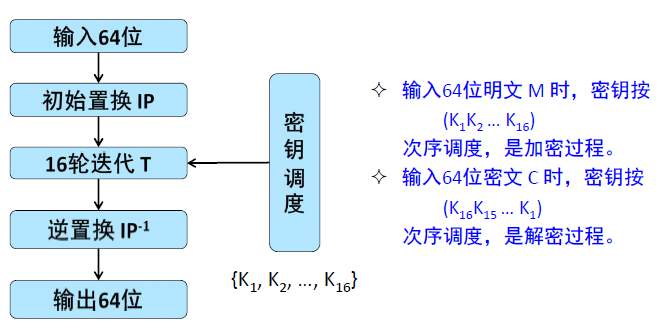
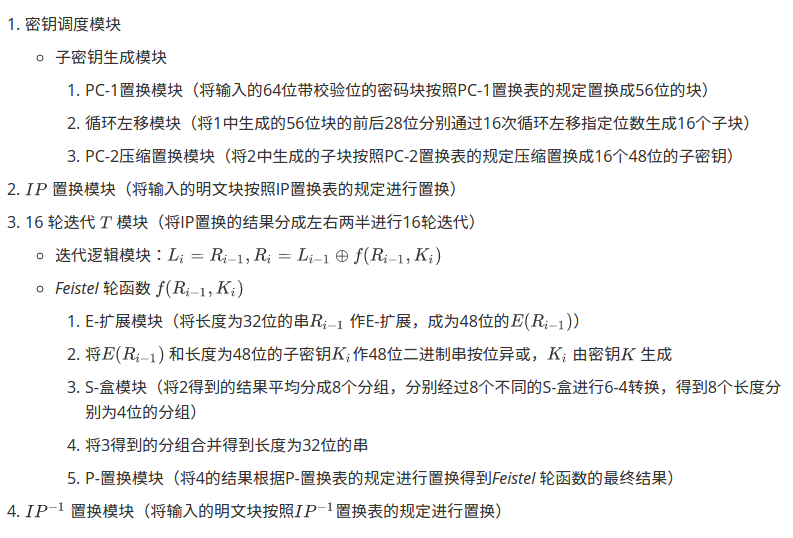

# DES算法的详细设计
------

## 算法原理概述

- DES算法是一种典型的块加密算法，以64位为一组的明文块作为输入，经过加密后输出同样64位的密文。
- DES算法使用加密密钥定义变换过程，算法认为只有使用加密所使用的密钥才可以解密
- DES算法使用64位密钥，但是实际上64位密钥被分成8个分组，每个分组的最后一位为奇偶校验位，实际的密钥长度为56位。
- DES算法的基本过程是 **换位** 和 **置换**
------


## 总体结构

DES算法的总体结构—— *Feistel* 结构



------

## 模块分解


------

## 数据结构

​	根据算法的实际需要，分别需要32位、48位、56位和64位的块。另外几个置换规则表可以用线性表结构（如C语言的数组），S-box可以用三维数组表示。

------

## 类-C语言算法过程

DES算法实现已经上传github，具体可以在DES目录下运行以下命令：

```shell
./run.sh
```

