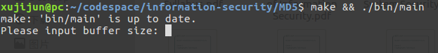
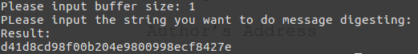
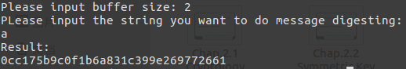
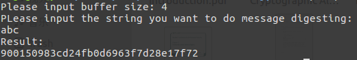
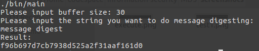
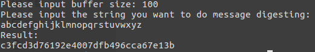
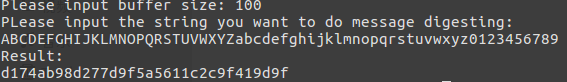
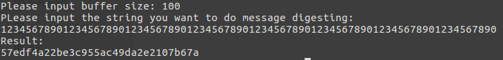
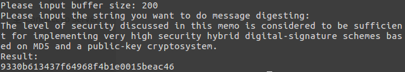

# README

本项目为《信息安全技术》第二次project，具体项目代码已上传[github](https://github.com/xujj25/information-security/tree/master/MD5)

------

## 运行

在项目主目录下运行：

```shell
make && ./bin/main
```

------

## 测试样例及截图

### 运行：



### 测试样例（前7个为[RFC1321](https://www.rfc-editor.org/rfc/rfc1321.txt)附带的样例）

1. `testString = "" `

   

2. `testString = "a"`

   

3. `testString = "abc"`

   

4. `testString = "message digest"`

   

5. `testString = "abcdefghijklmnopqrstuvwxyz"`

   

6. `testString = "ABCDEFGHIJKLMNOPQRSTUVWXYZabcdefghijklmnopqrstuvwxyz0123456789"`

   

7. ​
```
testString = "12345678901234567890123456789012345678901234567890123456789012345678901234567890"
```

   

8. ​
```
testString = "The level of security discussed in this memo is considered to be sufficient for implementing very high security hybrid digital-signature schemes based on MD5 and a public-key cryptosystem."
```

   

------

## Show how MD5 works for password protection

md5属于一种散列方法，如果对密码进行md5处理（制作消息摘要），生成的消息摘要与原来的密码是唯一对应的，并且从摘要出发是无法逆向计算出密码的（又测例可以看出，散列值无实际意义，且长度为定长；且无法用可行数学方法逆向计算密码），所以md5可以对密码起到一定的保护作用。